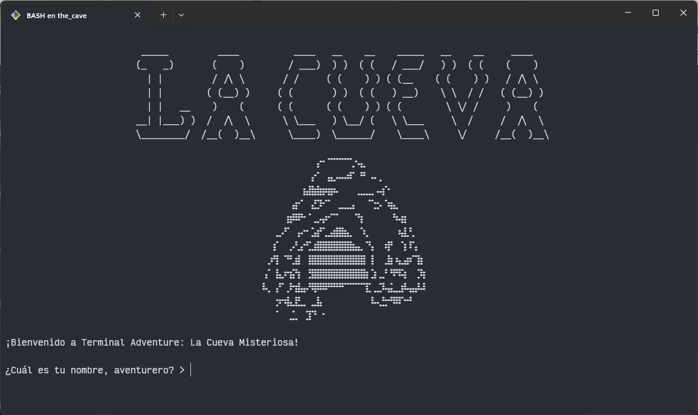

# Terminal Adventure: La Cueva Misteriosa 🏔️⚔️

¡Adéntrate en una emocionante aventura de texto donde tus decisiones determinan tu destino! Explora cuevas misteriosas, resuelve acertijos y enfréntate a criaturas legendarias en este juego interactivo de terminal.

 <!-- Si tienes screenshots -->

## Características Principales 🎮
- ✅ Sistema de inventario interactivo
- ✅ Mecánica de salud y combate estratégico
- ✅ 8 ubicaciones únicas con diferentes desafíos
- ✅ Arte ASCII detallado
- ✅ Múltiples finales según tus decisiones
- ✅ Sistema de diálogo interactivo numerado
- ✅ Efectos de texto tipo máquina de escribir

## Requisitos del Sistema 💻
- Python 3.8 o superior
- Sistema operativo Windows, Linux o macOS

## Instalación y Ejecución ⚙️

### Desde código fuente:
```bash
# 1. Clonar el repositorio
git clone https://github.com/agustincomolli/terminal-adventure.git

# 2. Entrar al directorio
cd terminal-adventure

# 3. Ejecutar el juego
python the_cave.py
```

## Versión Ejecutable (Windows):
1. Descarga la última versión desde [Releases](https://github.com/tu-usuario/terminal-adventure/releases)
2. Ejecuta `the_cave.exe`
3. ¡Juega sin necesidad de instalar Python!

## Cómo Jugar 🕹️
- Usa números para seleccionar opciones
- Gestiona tu inventario sabiamente (🔑, 🗡️, 🧪)
- Vigila tu salud (❤️ 100 puntos iniciales)
- Explora todas las ubicaciones para descubrir secretos
- ¡Cuidado con las decisiones apresuradas!

## Estructura del Proyecto 📁
```bash
.
├── the_cave.py # Punto de entrada principal
├── utils.py # Funciones de utilidad
├── inventory.py # Sistema de inventario
├── assets/ # Arte ASCII y recursos
│ └── art.py
├── locations/ # Módulos de ubicaciones
│ ├── cave.py
│ ├── dragon.py
│ └── ...
└── main.spec # Configuración de PyInstaller
```
## Contribuir 🤝
¡Las contribuciones son bienvenidas! Sigue estos pasos:

1. Haz fork del proyecto
2. Crea una rama (`git checkout -b feature/nueva-caracteristica`)
3. Haz commit de tus cambios (`git commit -am 'Add some feature'`)
4. Haz push a la rama (`git push origin feature/nueva-caracteristica`)
5. Abre un Pull Request

## Licencia 📄
Este proyecto está bajo la licencia MIT - ver [LICENSE](LICENSE) para más detalles.

## Créditos 🙏
- Desarrollado por [Agustín Comolli] 👨💻
- Arte ASCII generado con [patorjk.com](https://patorjk.com/software/taag/)
- Empaquetado con [PyInstaller](https://www.pyinstaller.org/)

---

¡Que comience la aventura! ⚔️🧙♂️ [Descárgalo ahora](https://github.com/agustincomolli/terminal-adventure/releases)